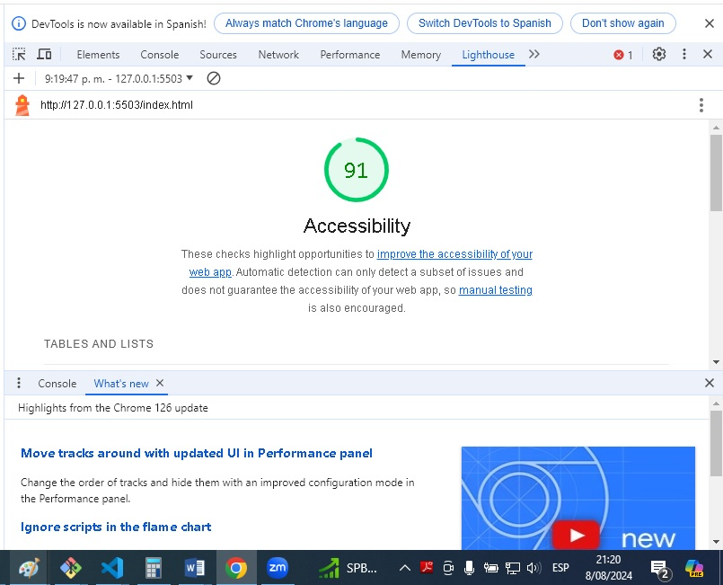

# aboutme
Proyecto: Web sobre mi Perfil Profesional
### Autor: Vladimir Jáuregui Canchari

### Enlaces y Recursos

* 
* [enlace de github](https://github.com/entertechschool/lima-code-201n3/blob/main/configs/.gitignore)

## Pagina web sobre mi perfil

### Estructura del Proyecto
* Identificación del usuario
* Juego de adivinanzas
* Resultado de preguntas correctas
* Presentación inicial de  página web personal
* Evaluación final de accesibilidad es 91%

### Reflexiones y Comentarios
* Revisar logros adicionales
* Requiere más tiempo codificar e implementar logros adiconales.